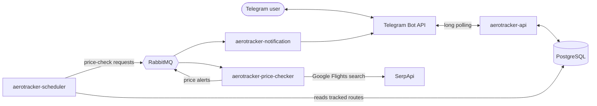

# AeroTracker


[](https://github.com/escalasebastian/AeroTracker/actions/workflows/ci.yml)

AeroTracker is a Telegram bot that watches flight prices for you. Set a target price for a route and it messages you as soon as a real Google Flights fare drops to that price or below.

Behind the bot there are four Spring Boot services that talk to each other through RabbitMQ, running on AWS ECS Fargate with PostgreSQL on RDS. The whole AWS infrastructure is described in Terraform and can be switched on and off with a single variable.

## Try it

Open [@AeroTrackerDevBot](https://t.me/AeroTrackerDevBot) on Telegram and press **Start**.

| Command | What it does |
|---|---|
| `/start`, `/help` | Shows how to use the bot |
| `/price MAD AMS 2027-03-15` | Instant simulated quote. Add a return date for a round trip |
| `/track MAD AMS 2027-03-15 150` | Alert when a real Google Flights fare drops to 150 EUR or below. Add a return date before the price for a round trip |
| `/list` | Your active alerts |
| `/untrack 1` | Cancels an alert, using its number in `/list` |

`/price` is simulated on purpose: anyone can run it as often as they like, so it never spends the metered flight-data quota. Real fares come through `/track`.

The public instance runs during launch periods and on request rather than around the clock, to keep the cloud bill near zero (see [Cost](#cost-a-single-onoff-switch)).

## Architecture



| Service | Responsibility |
|---|---|
| `aerotracker-api` | Talks to Telegram through long polling, validates commands and manages users and alerts in PostgreSQL |
| `aerotracker-scheduler` | Every 5 minutes, publishes one price-check request per distinct tracked route |
| `aerotracker-price-checker` | Prices each route and publishes an alert when a fresh fare reaches a user's target |
| `aerotracker-notification` | Sends the alerts to Telegram |
| `aerotracker-common` | Shared module: entities, repositories and the `FlightPriceProvider` abstraction |

### Design decisions

- **Long polling instead of webhooks.** The bot pulls updates from Telegram, so nothing accepts traffic from the internet: no public ports, no load balancer, no TLS certificates to manage.
- **Asynchronous pipeline.** Scheduling, pricing and notifying are separate services connected by queues. A slow flight-data API never blocks the bot, and each stage can fail and recover on its own.
- **One lookup per route, not per user.** Routes are normalized, so everyone tracking the same flight shares a single price lookup.
- **Protecting a small quota.** The SerpApi free plan allows 250 searches per month. The price-checker keeps a 24-hour price cache per route, stops at a hard budget of 200 calls per month, backs off for 24 hours on routes that fail, skips flights that have already departed, and only evaluates alerts against freshly fetched prices.
- **Fair use of shared capacity.** At most 8 distinct routes are monitored at once, and each person can keep up to 2 active alerts, so a single user cannot take every slot. Airport codes and target prices are validated before anything is priced or stored.
- **Swappable price providers.** Services depend on the `FlightPriceProvider` interface. The simulated provider serves `/price` and local development; the SerpApi provider serves `/track` when a key is configured.

## Infrastructure on AWS

- **Region `eu-west-1`:** 5 ECS Fargate services (the four Spring Boot services plus RabbitMQ), RDS PostgreSQL 16 in private subnets, Cloud Map private DNS so the services find RabbitMQ at `rabbitmq.aerotracker.local`, CloudWatch logs and dashboard, and SNS email alerts when a service stops running.
- **Infrastructure as Code:** everything is managed with Terraform in [`infra/terraform`](infra/terraform). The platform was first built by hand and then adopted into Terraform with `import` blocks, without recreating anything.
- **Secrets:** the database password, the Telegram token and the SerpApi key live in SSM Parameter Store as `SecureString` parameters and reach the containers through the task definitions, never as plain environment variables.
- **Network exposure:** nothing accepts inbound traffic from the internet. The database is only reachable from the services, and the SSH bastion only exists while access is explicitly requested for a single address.
- **CI/CD:** GitHub Actions builds and verifies every pull request, and on every merge to `main` pushes the four images to GitHub Container Registry, from which ECS pulls them.

### Cost: a single on/off switch

Fargate and RDS are not free, so the platform is off by default. One Terraform variable controls everything:

```bash
terraform apply -var="platform_enabled=true"   # bring AeroTracker up
terraform apply                                # switch it off again
```

Switched on, it costs about 2.70 USD per day. Switched off, no task runs and neither the database nor the private DNS zone exists, so the idle cost is close to zero. The database is disposable: it is created empty on start-up, Flyway rebuilds the schema, and it is deleted without a snapshot on shutdown.

The full operating guide is in [`docs/aws-setup.md`](docs/aws-setup.md).

## Run it locally

You need Docker and a Telegram bot token from [BotFather](https://t.me/botfather).

```bash
git clone https://github.com/escalasebastian/AeroTracker.git
cd AeroTracker
cp .env.example .env    # then set TELEGRAM_BOT_TOKEN
docker compose up --build
```

This starts PostgreSQL, RabbitMQ and the four services. `SERPAPI_KEY` is optional: without it, tracked routes are priced with simulated data, which is enough to see the whole alert flow. Thanks to long polling, no tunnel such as ngrok is needed.

Telegram only lets one program read a bot's messages at a time, so use a separate bot token for local development while another instance of the same bot is running.

## Project structure

```text
aerotracker-api/             Telegram bot, commands, users and alerts
aerotracker-scheduler/       Periodic price-check requests
aerotracker-price-checker/   Price providers, quota protection, alerts
aerotracker-notification/    Telegram notifications
aerotracker-common/          Shared entities, repositories and provider abstraction
infra/terraform/             AWS infrastructure as code
docs/                        AWS operating guide and roadmap
```

## Roadmap

| Phase | Focus | Main technologies |
|---|---|---|
| 1 | Manual price queries | Spring Boot, Telegram Bot API |
| 2 | Persistence and alerts | PostgreSQL, Spring Data JPA, Flyway |
| 3 | Automatic monitoring | Spring scheduling |
| 4 | Distributed architecture | RabbitMQ, event-driven design |
| 5 | Containerization | Docker, Docker Compose |
| 6 | CI/CD | GitHub Actions, GitHub Container Registry |
| 7 | AWS deployment | ECS Fargate, RDS, Cloud Map, CloudWatch |
| 8 | Infrastructure as Code and real prices | Terraform, SSM Parameter Store, SerpApi |

Next: an automated test suite. Today CI builds every module and runs a Spring context test, and changes are verified manually end to end with Docker Compose and the bot before they are merged.

## License

AeroTracker is released under the [MIT License](LICENSE).
